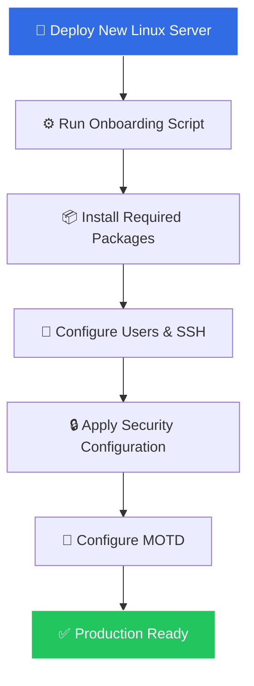

<div align="center">

# 🚀 Infrastructure Automation Shell Scripts

### **Linux** • **Kubernetes** • **Server Onboarding** • **SSL Management** • **Cloud VM Tooling**

*Automating the repetitive. Simplifying the complex.*

<br/>


</div>

---

## 📖 About

This repository is a **growing collection of production-minded shell scripts** built to automate repetitive Linux infrastructure and system administration tasks. Every script is written to save time, reduce human error, and standardize how servers are deployed and maintained.

<div align="center">

| 🎯 Goal | 💥 Impact |
|:--------|:----------|
| Reduce manual administrative effort | Fewer repetitive tasks, more engineering time |
| Standardize server deployments | Consistent, repeatable builds |
| Improve operational consistency | Predictable environments across fleets |
| Accelerate troubleshooting | Faster diagnostics and validation |
| Automate common workflows | Hands-off, reliable operations |

</div>

---

## 🗂 Repository Structure

```text
shell-script/
│
├── 🖥  server-onboarding/            # Post-deploy Linux server setup
├── ☸️  kubernetes/                   # kubeadm cluster utilities & validation
├── 📢  motd-message/                 # Dynamic Message of the Day banners
├── ☁️  vm-from-cloud-images/
│       └── vm-tools/                 # Prep tools for cloud-image based VMs
├── 🔐  copy-ssl-from-remote.sh       # Remote SSL certificate transfer
└── 📄  README.md
```

---

## ⚙️ Automation Categories

### 🖥 Server Onboarding
> Automates the routine tasks performed right after a new Linux server is deployed.

<table>
<tr>
<td width="50%" valign="top">

**🔧 What It Handles**
- ✅ System updates & patching
- ✅ Package installation
- ✅ User creation & shell setup
- ✅ SSH configuration
- ✅ Time synchronization

</td>
<td width="50%" valign="top">

**💡 Why It Matters**
- 🚀 Faster, consistent provisioning
- 🔒 Baseline security applied every time
- 📦 No forgotten prerequisites
- 🧩 Standardized environment prep
- ♻️ Repeatable across the fleet

</td>
</tr>
</table>

---

### 🔐 SSL Certificate Management
> `copy-ssl-from-remote.sh` — simplifies copying and migrating SSL certificate material from remote systems.

- 📥 **Copy** certificates from remote hosts over SSH
- 🗄 **Back up** existing certificate files before replacement
- 🔄 **Migrate** certificate chains between servers
- ✋ **Reduce** manual, error-prone certificate handling

> [!WARNING]
> Always protect private keys, preserve restrictive permissions, and **never** commit secrets to source control or leave them in shell history.

---

### ☸️ Kubernetes Utilities
> Tools and scripts that assist with **kubeadm-based** Kubernetes administration, validation, and troubleshooting.

<table>
<tr>
<td width="50%" valign="top">

**🛠 Common Use Cases**
- 🧱 Host preparation & prerequisites
- 🩺 Node & cluster health validation
- 🔍 Container runtime checks
- 🌐 CNI / networking validation

</td>
<td width="50%" valign="top">

**📌 Operational Value**
- ⚡ Faster cluster troubleshooting
- ✅ Consistent, verifiable readiness
- 🧪 Safe, testable operations
- 📊 Clear pass/fail signals

</td>
</tr>
</table>

> [!TIP]
> Validate Kubernetes scripts against your cluster's Kubernetes, container runtime, and CNI versions. Run audits **before** changing an existing cluster.

---

### 📢 MOTD Configuration
> Automates **Message of the Day** customization for informative, branded login banners.

- 🖥 Hostname & OS identification
- 📊 CPU, memory, disk, uptime & load at a glance
- 🌐 Network & environment status
- 📣 Administrative notices & environment tagging

> [!NOTE]
> MOTD mechanisms differ by distro — Debian/Ubuntu use `/etc/update-motd.d/`, while others may use `/etc/motd` or `/etc/profile.d/`.

---

### ☁️ Cloud-Image VM Tools
> `vm-from-cloud-images/vm-tools/` — turns a minimal cloud image into a usable, consistently configured VM.

- 🧰 Guest preparation & post-deployment tasks
- 🌐 Network & guest-agent configuration
- 📦 Package source setup
- 🔁 Consistent, repeatable VM builds

---

## 🏗 Example Automation Workflow

<div align="center">



</div>

---

## 🧰 Requirements

<div align="center">

### Supported Distributions

| Distribution | Status | Distribution | Status |
|:-------------|:------:|:-------------|:------:|
| 🟠 **Ubuntu** | ✅ | 🔵 **Debian** | ✅ |
| 🔷 **Fedora** | ✅ | 🟢 **Rocky Linux** | ✅ |
| 🔴 **AlmaLinux** | ✅ | ☁️ **Cloud Images** | ✅ |

</div>

**General prerequisites:**
- 🐧 A supported Linux distribution & **Bash**
- 🧑‍💻 Standard GNU/Linux command-line utilities
- 🔑 `sudo` / root access for system-level changes
- 🌐 Network access to package repositories
- ☸️ `kubectl`, `kubeadm`, `kubelet` + compatible runtime *(Kubernetes workflows)*

> [!IMPORTANT]
> Not every script supports every distribution. Package names, service names, and config paths differ — **always treat the checks and comments inside each script as the source of truth.**

---

## 🚀 Getting Started

**1️⃣ Clone the repository**
```bash
git clone https://github.com/iamraj-patel/shell-script.git
cd shell-script
```

**2️⃣ Inspect before you run** *(recommended)*
```bash
less path/to/script.sh          # Read it
bash -n path/to/script.sh       # Check syntax
shellcheck path/to/script.sh    # Static analysis (if installed)
```

**3️⃣ Grant execute permission & run**
```bash
chmod +x path/to/script.sh
sudo ./path/to/script.sh
```

> [!NOTE]
> Use `sudo` **only** when a script performs system-level operations — and only after reviewing its contents.

---

## ✅ Recommended Validation Workflow


1. **Inspect** every system file, package, and service the script may change
2. **Check syntax** with `bash -n`
3. **Run ShellCheck** and resolve relevant findings
4. **Test** in a disposable VM matching the target OS
5. **Back up** configuration and capture the pre-change state
6. **Execute** with appropriate privileges and monitor output
7. **Validate** with service status, logs, and health checks
8. **Confirm idempotency** — a safe second run should not cause destructive changes

---

## 🔒 Security Guidance

| 🚫 Never | ✅ Always |
|:---------|:----------|
| Commit keys, tokens, or kubeconfig secrets | Use least privilege & scoped `sudo` |
| Trust unverified packages or repos | Verify signing keys & sources |
| Overwrite configs without backups | Back up before replacing files |
| Expose secrets via `bash -x` tracing | Guard permissions on SSH/TLS files |
| Apply cluster-wide changes blindly | Change one Kubernetes node at a time |

---

## 🤝 Contributing

Issues, corrections, and improvements are welcome! 🎉

```bash
git checkout -b feature/improve-kubernetes-validation
# make and test your changes
git add .
git commit -m "Improve Kubernetes validation checks"
git push origin feature/improve-kubernetes-validation
```

**Guidelines:** keep values configurable • comment non-obvious logic • preserve safe error handling • test on affected distros • run `bash -n` + ShellCheck • update this README for major changes.

---

## 🗺 Roadmap

- [ ] 📚 Per-directory documentation with exact prerequisites & examples
- [ ] 🧩 Consistent `--help` / `--version` / non-interactive options
- [ ] 🧪 Dry-run support for state-modifying scripts
- [ ] 🤖 Automated ShellCheck & syntax validation via GitHub Actions
- [ ] 🏷 Release tags & changelogs for stable versions
- [ ] 🐧 Broader test coverage across supported distributions
- [ ] 📊 Standardized logging, error handling & exit codes

---

## 📜 License

No license is currently specified in the repository. Until a `LICENSE` file is added, the code remains publicly viewable, but reuse, modification, and redistribution rights are **not explicitly granted**.

---

<div align="center">

## 👤 Author

### **Raj Patel**
**Infrastructure Managed Services Senior Analyst**

*Linux • Windows Server • VMware • Kubernetes • Automation*

[](https://github.com/iamraj-patel)
[](https://iamraj-patel.github.io)

<br/>

*⭐ If these scripts save you time, consider starring the repository!*

**Automate the Repetitive. Simplify the Complex.**

</div>
